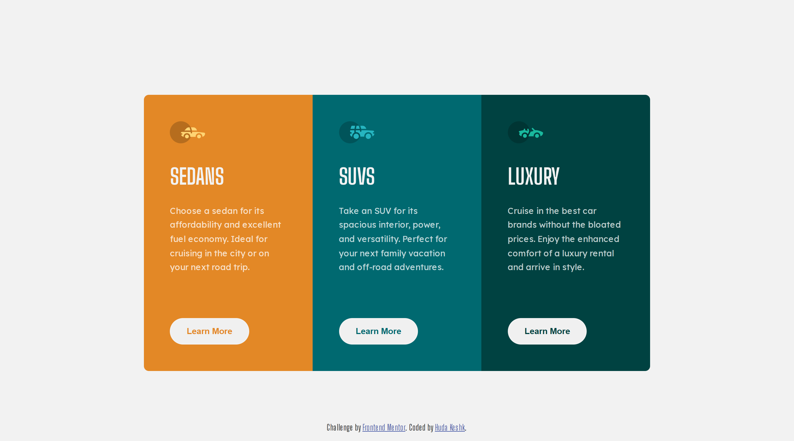

# Frontend Mentor - 3-column preview card component solution

This is a solution to the [3-column preview card component challenge on Frontend Mentor](https://www.frontendmentor.io/challenges/3column-preview-card-component-pH92eAR2-). Frontend Mentor challenges help you improve your coding skills by building realistic projects. 

## Table of contents

- [Overview](#overview)
  - [The challenge](#the-challenge)
  - [Screenshot](#screenshot)
  - [Links](#links)
- [Author](#author)

## Overview

### The challenge

Users should be able to:

- View the optimal layout depending on their device's screen size
- See hover states for interactive elements

### Screenshot

### Links

- Solution URL: [Solution URL](https://github.com/H-Keshk/3-Column-Card-HTML-CSS-)
- Live Site URL: [Live site URL](https://h-keshk.github.io/3-Column-Card-HTML-CSS-/)

## Author

- Frontend Mentor - [@H-Keshk](https://www.frontendmentor.io/profile/H-Keshk)
- X - [@HudaKeshk15889](https://www.twitter.com/HudaKeshk15889)
- Facebook - [@HudaKeshk](https://www.facebook.com/HudaKeshk)
- Github - [@H-Keshk](https://github.com/H-Keshk)
- LinkedIn - [@hoda-mohamed](https://www.linkedin.com/in/hoda-mohamed-180735107/)
